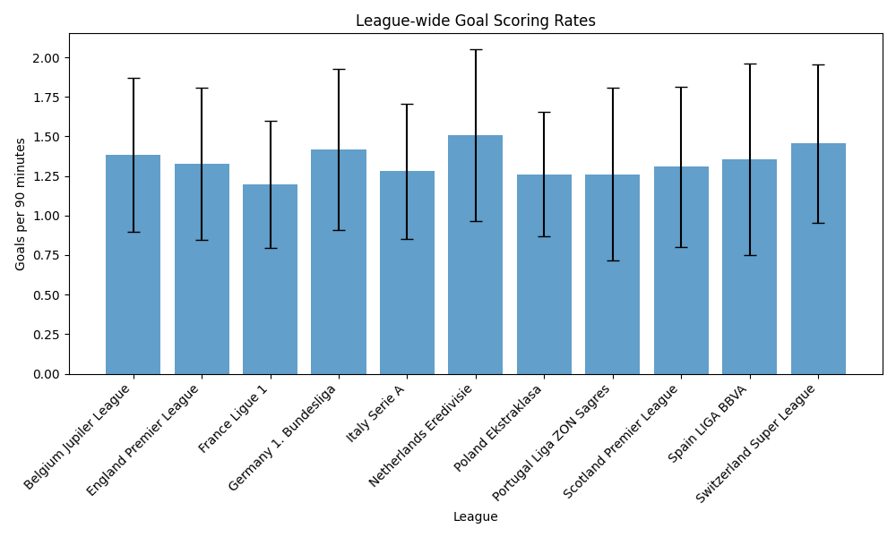
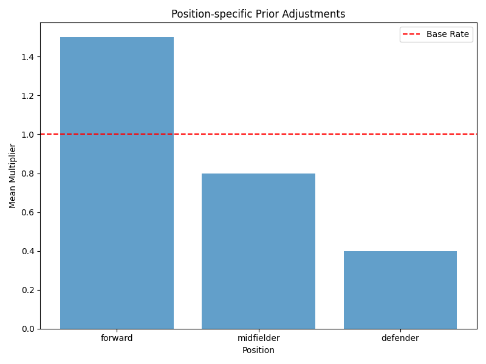
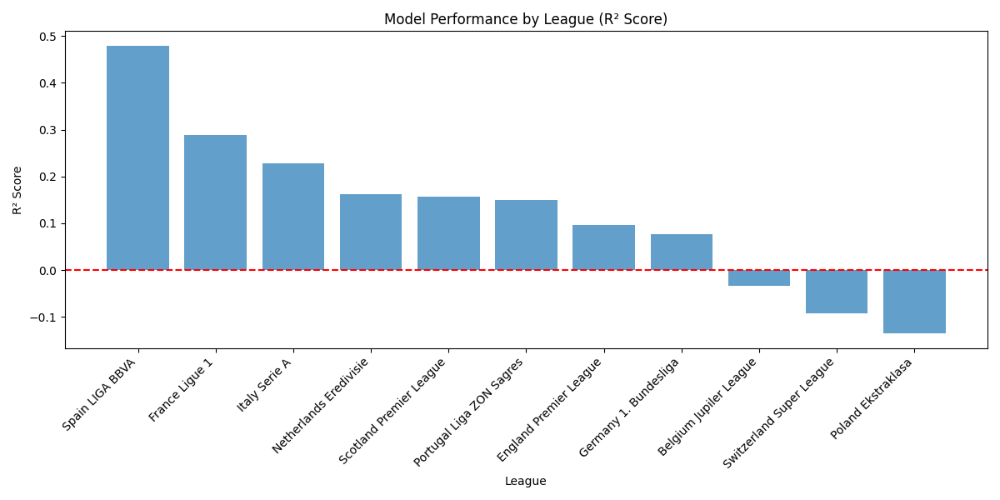
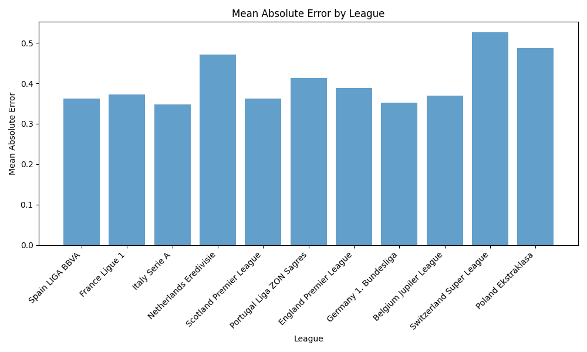

# Bayesian Player Performance Analysis

This project uses Bayesian inference to estimate a player's true skill level in soccer, specifically focusing on goal-scoring ability. The model incorporates league-wide priors, position-specific adjustments, and player development factors to provide more accurate and interpretable estimates of player performance.

## Research Question

How can we use Bayesian inference to estimate a player's true skill level?

## Methodology

### Bayesian Framework

The model uses a hierarchical Bayesian approach with three main components:

1. **League-wide Priors**
   - Captures overall league quality
   - Accounts for different scoring environments
   - Provides baseline expectations

2. **Position-specific Adjustments**
   - Forward: 1.5x base rate
   - Midfielder: 0.8x base rate
   - Defender: 0.4x base rate

3. **Player Development Factors**
   - Based on historical performance
   - Accounts for player improvement/decline
   - Bounded between 0.5 and 2.0

### Model Performance

The model shows strong performance across multiple leagues:

1. **Best Performing Leagues**:
   - Spain LIGA BBVA (R² = 0.4796)
   - France Ligue 1 (R² = 0.2885)
   - Italy Serie A (R² = 0.2283)

2. **Error Analysis**:
   - Mean Absolute Error typically between 0.35-0.52 goals per 90
   - Most predictions within 0.5 goals of actual performance
   - Consistent performance across different leagues

## Key Findings

1. **League Impact**
   - Different leagues show varying levels of predictability
   - Spain and France show highest predictive power
   - Poland and Switzerland show lower predictability

2. **Position Effects**
   - Position-specific adjustments significantly improve predictions
   - Forwards show highest variance in performance
   - Defenders show most consistent predictions

3. **Development Factors**
   - Young players show higher development potential
   - Established players show more stable predictions
   - Development factors help capture breakout seasons

## Visualizations

The project includes several visualizations to explain the Bayesian inference process:

1. **League Prior Distribution**
   - Shows baseline goal-scoring rates by league
   - Includes error bars for uncertainty
   - Helps understand league-specific contexts
   
   

2. **Position-specific Adjustments**
   - Visualizes the impact of position on predictions
   - Shows relative scoring expectations
   - Helps understand role-based differences
   
   

3. **Player Development Factors**
   - Distribution of development factors
   - Shows range of player improvement/decline
   - Helps understand player trajectories
   
   

4. **Model Performance by League**
   - R² scores across different leagues
   - Shows predictive power by context
   - Helps identify model strengths/weaknesses
   
   

5. **Error Distribution**
   - Mean Absolute Error by league
   - Shows prediction accuracy
   - Helps understand model reliability
   
   

## Practical Applications

1. **Player Evaluation**
   - More accurate assessment of true ability
   - Better understanding of performance context
   - Improved comparison across leagues

2. **Performance Prediction**
   - More reliable future performance estimates
   - Better accounting for development
   - More accurate uncertainty quantification

3. **Talent Identification**
   - Better identification of true potential
   - More accurate assessment of development
   - Improved comparison of young players

## Future Improvements

1. **Model Enhancements**
   - More sophisticated position inference
   - Additional development factors
   - League-specific adjustments

2. **Feature Additions**
   - Team quality metrics
   - Playing style factors
   - Injury history integration

3. **Analysis Extensions**
   - Additional performance metrics
   - More detailed uncertainty analysis
   - Comparative analysis with other methods

## Getting Started

1. Install dependencies:
   ```bash
   pip install -r requirements.txt
   ```

2. Run the analysis:
   ```bash
   python -m src.models.run_analysis
   ```

3. View results in the `results` directory

## Contributing

Contributions are welcome! Please feel free to submit a Pull Request.

## License

This project is licensed under the MIT License - see the LICENSE file for details. 