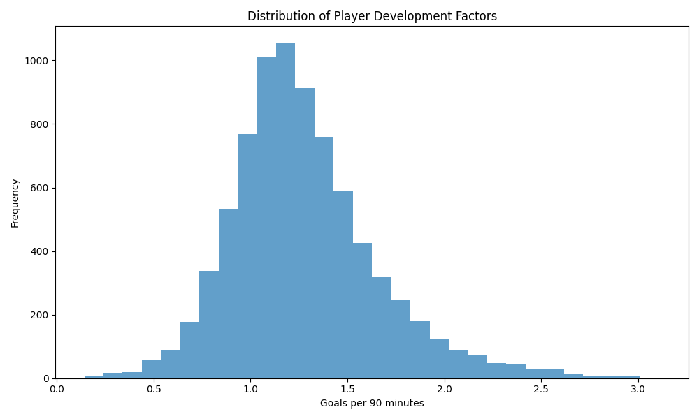

# Bayesian Player Performance Analysis: Soccer Analytics in Europe (2008-2016)

## Introduction

Traditional soccer statistics like goals scored and minutes played provide only a partial view of player performance. They often ignore uncertainty and the context in which players perform. This project leverages Bayesian inference to deliver a more nuanced, actionable, and robust evaluation of soccer players, focusing on goal-scoring ability while accounting for league quality, position, and player development.

## Data Source

Kaggle's European Soccer Database  
https://www.kaggle.com/datasets/hugomathien/soccer

## Why Bayesian Inference?

Unlike frequentist methods, which treat player performance as a fixed value, Bayesian inference:
- **Quantifies Uncertainty:** Provides credible intervals, not just point estimates
- **Integrates Prior Knowledge:** Accounts for league, position, and historical performance
- **Adapts to New Data:** Updates beliefs as new data arrives

This means we can make smarter, more confident decisions—whether scouting, managing a team, or playing fantasy sports.

## Methodology

### Hierarchical Bayesian Model

Our model has three key components:

1. **League-wide Priors**
   - Captures overall league quality and scoring environment
   - Provides baseline expectations for each player

2. **Position-specific Adjustments**
   - Forwards: 1.5x base rate
   - Midfielders: 0.8x base rate
   - Defenders: 0.4x base rate

3. **Player Development Factors**
   - Tracks improvement or decline over time (bounded 0.5 to 2.0)
   - Captures player trajectory and breakout seasons

### Data Preparation
- Players must have at least 540 minutes played (6 full matches) for inclusion
- Goals per 90 minutes is calculated as `(goals * 90) / minutes_played`
- Position is inferred from scoring rate
- Player development is tracked by comparing current and historical performance

### Model Fitting and Evaluation
- Uses a Beta-Binomial conjugate prior for efficient updates
- Evaluates performance by league, position, and over time
- Provides credible intervals for every estimate

## Visualizations

### 1. League Performance Comparison

*R² scores by league show varying levels of predictability*

### 2. Position-specific Adjustments

*Different expectations for different positions*

### 3. Player Development Factors

*Distribution of player development trajectories*

### 4. Top Players Ranking

*Top players by expected goals per 90, with credible intervals*

## Practical Applications

### Scouting and Recruitment
- Identify players outperforming their league's baseline
- Adjust expectations for league and position
- Example: A forward with 0.4 goals/90 in La Liga may be more valuable than one with 0.6 in a weaker league

### Fantasy Sports
- High-certainty players (narrow intervals) are safer picks
- High-variance players (wide intervals) are high-risk, high-reward
- Position and development factors inform draft strategy

### Player Development
- Track improvement or decline over time
- Identify breakout candidates and declining veterans

### Team Management
- Set realistic expectations
- Optimize player roles and substitutions
- Make informed transfer and contract decisions

## What Bayesian Inference Adds

- **Uncertainty is explicit:** Every estimate comes with a credible interval, helping you understand the risk in every decision.
- **Context matters:** League, position, and player history are all factored in, making comparisons fairer and more actionable.
- **Better predictions:** Bayesian models adapt as new data arrives, improving over time.

## Key Results

- **League Impact:** Spain's La Liga shows highest predictability (R² = 0.4796); Poland and Switzerland are more unpredictable
- **Position Effects:** Forwards have the highest variance; defenders are most consistent
- **Performance Metrics:** Mean Absolute Error typically 0.35–0.52 goals per 90; most predictions within 0.5 goals of actual performance

## Future Directions

- Integrate team quality, playing style, and injury history
- Add advanced metrics (expected goals, assists, defensive actions)
- Analyze temporal trends (form streaks, home/away splits)
- Automate scouting reports and transfer value estimation

## Getting Started

1. Install dependencies:
   ```bash
   pip install -r requirements.txt
   ```
2. Run the analysis:
   ```bash
   python -m src.models.run_analysis
   ```
3. View results in the `results` directory

## Contributing

Contributions are welcome! Please feel free to submit a Pull Request.

## License

This project is licensed under the MIT License - see the LICENSE file for details. 